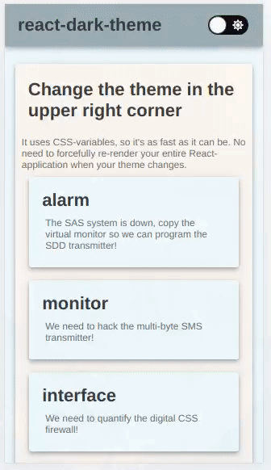

# react-dark-theme

> A dark theme toggle button with CSS variables

[](https://www.npmjs.com/package/react-dark-theme) [](https://prettier.io) [](https://github.com/karl-run/react-dark-theme)



## Install

```bash
npm install --save react-dark-theme
```

## Usage

`react-dark-theme` uses [CSS variables](https://developer.mozilla.org/en-US/docs/Web/CSS/Using_CSS_custom_properties) because they are really fast. React doesn't need to re-render your entire application when the style changes.

You can use it if you support modern browsers. In doubt? Check [caniuse.com](https://caniuse.com/#feat=css-variables) to make sure.

`react-dark-theme` is a button. Use it as you would any button, and provide it two themes.

### Usage with CSS

```jsx
import React from 'react'

import DarkTheme from 'react-dark-theme'

const lightTheme = {
  background: 'white',
  text: 'black',
}

const darkTheme = {
  background: 'black',
  text: 'white',
}

class Example extends React.Component {
  render() {
    return (
      <div>
        <DarkTheme light={lightTheme} dark={darkTheme} />
        Rest of your application
      </div>
    )
  }
}
```

In your CSS, refer to the names by `var(--yourName)`

```css
body {
  background-color: var(--background);
  color: var(--text);
}
```

### Usage with CSS-in-JS

Similar to usage in CSS, but you can also create a object that you can refer to your variables in:

```jsx
import React from 'react'

import DarkTheme, { createTheme } from 'react-dark-theme'

const lightTheme = {
  background: 'white',
  text: 'black',
}

const darkTheme = {
  background: 'black',
  text: 'white',
}

const myTheme = createTheme(darkTheme, lightTheme)

class Example extends React.Component {
  render() {
    return (
      <div style={{ backgroundColor: myTheme.background, color: myTheme.text }}>
        <DarkTheme light={lightTheme} dark={darkTheme} />
        Rest of your application
      </div>
    )
  }
}
```

This technique works with any CSS-in-JS library, and should in theory be _much_ faster than those libraries' "native" way to handle themes.

### My page looks weird while it is loading

If you are unable to load the `<DarkTheme ... />` component early in your life cycle you might see a few frames where your React components are rendered but the CSS variables are not set. The easiest fix for this is to allow `<DarkTheme ... />` to load earlier.

If this isn't an option, you can use `applyTheme(theme)`. Simply invoke this as soon as you define your theme.

```js

import { applyTheme } from 'react-dark-theme'

const darkTheme = {
  background: #BEEFED,
}

const normalTheme = {
  background: #DECADE,
}

applyTheme(normalTheme)
```

Make sure to apply your light heme if `defaultDark` is false on your `DarkTheme` component, and apply your dark theme if `defaultDark` is true.

### Props

##### DarkTheme:

| Property    |  Type   |  Default  | Description                                                                                               |
| ----------- | :-----: | :-------: | --------------------------------------------------------------------------------------------------------- |
| dark        | Object  |   null    | **required** `{ key: value }`-map of variables and their values. Keys _must_ correspond with `lightTheme` |
| light       | Object  |   null    | **required** `{ key: value }`-map of variables and their values. Keys _must_ correspond with `darkTheme`  |
| defaultDark | boolean |   false   | Whether or not dark theme should be default. False means light theme is default.                          |
| className   | string  | undefined | Optional className passed directly to react-toggle switch.                                                |

##### createTheme:

| Parameter |  Type  | Default | Description                                                                                               |
| --------- | :----: | :-----: | --------------------------------------------------------------------------------------------------------- |
| dark      | Object |  null   | **required** `{ key: value }`-map of variables and their values. Keys _must_ correspond with `lightTheme` |
| light     | Object |  null   | **required** `{ key: value }`-map of variables and their values. Keys _must_ correspond with `darkTheme`  |

##### applyTheme:

| Parameter |  Type  | Default | Description                                                                                               |
| --------- | :----: | :-----: | --------------------------------------------------------------------------------------------------------- |
| dark      | Object |  null   | **required** `{ key: value }`-map of variables and their values. Keys _must_ correspond with `lightTheme` |
| light     | Object |  null   | **required** `{ key: value }`-map of variables and their values. Keys _must_ correspond with `darkTheme`  |

### How does it work

This library uses [react-css-vars](https://github.com/karl-run/react-css-vars). Look at it's section about how it works. If you want something else than a simple toggle button for your theme (or more than a light and a dark theme) I suggest using `react-css-vars` directly.

## License

MIT © [karl-run](https://github.com/karl-run)
